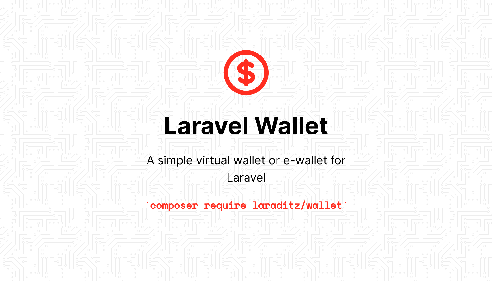

# Laravel Wallet

[](https://packagist.org/packages/laraditz/wallet)
[](https://packagist.org/packages/laraditz/wallet)
[](https://packagist.org/packages/laraditz/wallet)

A simple virtual wallet or e-wallet for Laravel.

## Installation

You can install the package via composer:

```bash
composer require laraditz/wallet
```

Run the migration command to create the necessary database table.

```bash
php artisan migrate
```

## Usage

Add the `HasWallets` trait to your model.

```php
use Laraditz\Wallet\Traits\HasWallets;

class User extends Authenticatable
{
    use HasWallets;
    ...
}
```

Create your default wallet. If you use a different name, you may need to set the `WALLET_DEFAULT` in your `.env` and set the value to the slug value. This is optional and only useful when you want to retrieve your wallet but do not want to specify the wallet slug.

```php
// Simply use below code to create a default wallet types
app('wallet')->createWalletType([
    'name' => 'Default',   
    'currency_code' => 'POINTS',
    'currency_symbol' => 'PTS',
]);
```

You also can specify many other setting when creating wallet type as below:-

```php
use Laraditz\Wallet\Enums\ActiveStatus;
use Laraditz\Wallet\Enums\Placement;

app('wallet')->createWalletType([
    'name' => 'New Wallet', // will produce new-wallet slug
    'description' => 'This is my new wallet',
    'currency_code' => 'POINTS',
    'currency_symbol' => 'PTS',
    'default_scale' => 0, // example, EUR and USD have 2 decimal places, while JPY has 0
    'decimal_separator' => '.', // default is using dot (.)
    'thousand_separator' => ',', // default is using comma (,)
    'code_placement' => Placement::Right, // default placement is left
    'symbol_placement' => Placement::Left, // default placement is left
    'status' => ActiveStatus::Active, // default status is active
    'start_at' => now(), // you can also set when the wallet can start be use
    'end_at' => now()->addDays(3), // or when it ends
]);
```

With that we are set. You can now deposit, withdraw or transfer using your e-wallet. 

```php
$userOne = User::find(1);
$walletOne = $userOne->getWallet(); // get default wallet for userOne

// deposit
$deposit = $walletOne->deposit("100"); // deposit amount of 100 into default wallet with processing status
$deposit->markAsCompleted(); // change the status from processing to completed

$walletOne->depositNow("100"); // Use depositNow() so that the transaction completed immediately

// withdraw
$withdraw = $walletOne->withdraw("100"); // withdraw amount of 100 into default wallet with processing status
$withdraw->markAsCompleted(); // change the status from processing to completed

$walletOne->withdrawNow("100"); // Use withdrawNow() so that the transaction completed immediately

$userTwo = User::find(2);
$walletTwo = $userTwo->getWallet(); // get default wallet for userTwo

// transfer amount from userOne to userTwo
$transfer = $walletOne->transfer($walletTwo, "100");
$transfer->markAsCompleted(); // change the status from processing to completed

$walletOne->transferNow($walletTwo, "100"); // Use transferNow() so that the transaction completed immediately

// get user transactions
$allTransactions = $userOne->transactions;

```

By default when you call `getWallet`, it will create the user wallet if it's not already been created. You wallet will be assigned a random unique wallet address value. But it is also possible for you to create the wallet with your own address value.

```php
$userThree = User::find(3);
$userThree->createWallet(
    slug: 'new-wallet', // specify the wallet slug
    values: [
        'address' => '0xf6A32f757196ac753A354F145F408bF88BEacf77',
        'description' => 'This is my crypto wallet', 
    ]
);

// specify the slug name to get the new wallet
$walletThree = $userThree->getWallet('new-wallet');

// to update description or/and metadata to the wallet
$walletThree->update([
    'description' => 'This is a new description', 
    'metadata' => [
        'user' => 'Farhan'
    ]
]);

```

### Testing

```bash
composer test
```

### Changelog

Please see [CHANGELOG](CHANGELOG.md) for more information what has changed recently.

## Contributing

Please see [CONTRIBUTING](CONTRIBUTING.md) for details.

### Security

If you discover any security related issues, please email raditzfarhan@gmail.com instead of using the issue tracker.

## Credits

-   [Raditz Farhan](https://github.com/laraditz)

## License

The MIT License (MIT). Please see [License File](LICENSE.md) for more information.
